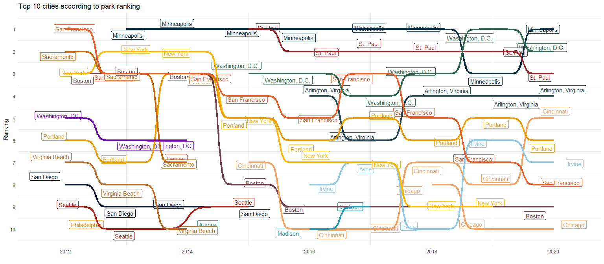

```r
library(tidyverse)     # for graphing and data cleaning
library(lubridate)     # for date manipulation
library(ggthemes)      # for even more plotting themes
library(ggbump)
library(RColorBrewer)
library(ggmap)
library(gganimate)
library(maps)
theme_set(theme_minimal()) # My favorite ggplot() theme :)
```


```r
# Get the Data

# Read in with tidytuesdayR package 
# Install from CRAN via: install.packages("tidytuesdayR")
# This loads the readme and all the datasets for the week of interest

# Either ISO-8601 date or year/week works!

tuesdata <- tidytuesdayR::tt_load('2021-06-22')
```

```
## 
## 	Downloading file 1 of 1: `parks.csv`
```

```r
tuesdata <- tidytuesdayR::tt_load(2021, week = 26)
```

```
## 
## 	Downloading file 1 of 1: `parks.csv`
```

```r
parks <- tuesdata$parks

# Or read in the data manually
# 
# parks <- readr::read_csv('https://raw.githubusercontent.com/rfordatascience/tidytuesday/master/data/2021/2021-06-22/parks.csv')
```


```r
# Cleaning script from the github page

library(tidyverse)
library(pdftools)

raw_pdf <- pdftools::pdf_text("https://parkserve.tpl.org/mapping/historic/2020_ParkScoreRank.pdf")

raw_text <- raw_pdf[[1]] %>% 
  str_split("\n") %>% 
  unlist()

table_trimmed <- raw_text %>% 
  .[13:(length(raw_text)-1)] %>% 
  str_trim()

all_col_names <- c(
  "rank",
  "city",
  "med_park_size_data",
  "med_park_size_points",
  "park_pct_city_data",
  "park_pct_city_points",
  "pct_near_park_data",
  "pct_near_park_points",
  "spend_per_resident_data",
  "spend_per_resident_points",
  "basketball_data",
  "basketball_points",
  "dogpark_data",
  "dogpark_points",
  "playground_data",
  "playground_points",
  "rec_sr_data",
  "rec_sr_points",
  "restroom_data",
  "restroom_points",
  "splashground_data",
  "splashground_points",
  "amenities_points",
  "total_points",
  "total_pct",
  "city_dup"
)

tab_names <- fwf_empty(
  table_trimmed,
  col_names = all_col_names
)

park_2020_1 <- table_trimmed %>% 
  read_fwf(
    tab_names
  ) 

park_2020_2 <- raw_pdf[[2]] %>% 
  str_split("\n") %>% 
  unlist() %>% 
  .[1:41] %>% 
  str_trim() %>% 
  str_replace_all("\\s{2,}", "|") %>% 
  read_delim(
    delim = "|", 
    col_names = all_col_names
  )

all_2020 <- bind_rows(park_2020_1, park_2020_2) 

raw_pdf_19 <- pdftools::pdf_text("https://parkserve.tpl.org/mapping/historic/2019_ParkScoreRank.pdf")

raw_pdf_19[[1]] %>% 
  str_split("\n") %>% 
  unlist() %>% 
  .[13:53] %>% 
  str_trim() %>% 
  str_replace_all("\\s{2,}", "|") %>%
  str_replace_all("% ", "|") %>% 
  read_delim(
    delim = "|", 
    col_names = FALSE
  ) %>% 
  set_names(all_col_names[str_detect(all_col_names, "total_pct", negate = TRUE)]) %>% 
  glimpse()
```

```
## Rows: 41
## Columns: 25
## $ rank                      <dbl> 1, 2, 3, 4, 5, 6, 7, 8, 9, 10, 11, 12, 13, 1~
## $ city                      <chr> "Washington, D.C.", "St. Paul", "Minneapolis~
## $ med_park_size_data        <dbl> 1.4, 3.2, 5.7, 2.4, 4.9, 6.1, 1.3, 4.4, 1.1,~
## $ med_park_size_points      <dbl> 5.0, 15.0, 27.5, 10.0, 22.5, 30.0, 5.0, 20.0~
## $ park_pct_city_data        <chr> "21%", "15%", "15%", "11%", "18%", "27%", "2~
## $ park_pct_city_points      <dbl> 50.0, 40.0, 37.5, 27.5, 47.5, 50.0, 50.0, 35~
## $ pct_near_park_data        <chr> "98", "98%", "96%", "98%", "89%", "80%", "10~
## $ pct_near_park_points      <dbl> 97.5, 97.5, 95.0, 97.5, 85.0, 72.5, 100.0, 6~
## $ spend_per_resident_data   <chr> "$270", "$220", "$299", "$267", "$224", "$25~
## $ spend_per_resident_points <dbl> 100.0, 100.0, 100.0, 100.0, 100.0, 100.0, 10~
## $ basketball_data           <dbl> 5.9, 7.7, 3.5, 7.8, 3.8, 17.7, 4.1, 8.9, 4.0~
## $ basketball_points         <dbl> 97.5, 100.0, 52.5, 100.0, 57.5, 100.0, 65.0,~
## $ dogpark_data              <dbl> 1.9, 1.3, 1.7, 3.5, 5.4, 0.4, 4.2, 1.3, 1.7,~
## $ dogpark_points            <dbl> 85.0, 55.0, 75.0, 100.0, 100.0, 5.0, 100.0, ~
## $ playground_data           <dbl> 1.7, 4.0, 4.1, 4.4, 2.1, 4.0, 2.6, 5.0, 2.1,~
## $ playground_points         <dbl> 25.0, 77.5, 77.5, 87.5, 32.5, 77.5, 42.5, 10~
## $ rec_sr_data               <dbl> 2.3, 1.7, 2.3, 1.1, 0.6, 1.8, 0.8, 1.5, 0.1,~
## $ rec_sr_points             <dbl> 100, 100, 100, 73, 38, 100, 50, 98, 3, 100, ~
## $ restroom_data             <dbl> 2.9, 3.2, 3.0, 3.1, 2.0, 3.0, 2.6, 3.1, 0.8,~
## $ restroom_points           <dbl> 88, 100, 90, 95, 60, 90, 78, 95, 23, 70, 73,~
## $ splashground_data         <dbl> 3.9, 1.3, 0.2, 2.2, 2.5, 0.4, 0.8, 4.5, 6.8,~
## $ splashground_points       <dbl> 100, 50, 8, 85, 95, 13, 30, 100, 100, 100, 4~
## $ amenities_points          <dbl> 82.5, 80.4, 67.1, 90.0, 63.8, 64.2, 60.8, 90~
## $ total_points              <dbl> 83.8, 83.2, 81.8, 81.3, 79.7, 79.2, 79.0, 78~
## $ city_dup                  <chr> "Washington, D.C.", "St. Paul", "Minneapolis~
```

```r
park_2019_2 <- raw_pdf_19[[2]] %>% 
  str_split("\n") %>% 
  unlist() %>% 
  .[1:44] %>% 
  str_trim() %>% 
  str_replace_all("\\s{2,}", "|") %>%
  str_replace_all("% ", "|") %>% 
  read_delim(
    delim = "|", 
    col_names = FALSE
  ) %>% 
  set_names(all_col_names[str_detect(all_col_names, "total_pct", negate = TRUE)]) %>% 
  glimpse()
```

```
## Rows: 44
## Columns: 25
## $ rank                      <dbl> 54, 55, 56, 59, 60, 57, 57, 62, 63, 64, 66, ~
## $ city                      <chr> "Miami", "Los Angeles", "Phoenix", "Anaheim"~
## $ med_park_size_data        <dbl> 2.6, 4.8, 14.6, 8.3, 7.1, 16.7, 9.8, 10.5, 5~
## $ med_park_size_points      <dbl> 12.5, 22.5, 50.0, 40.0, 35.0, 50.0, 47.5, 50~
## $ park_pct_city_data        <chr> "7%", "13%", "15%", "8%", "26%", "11%", "8%"~
## $ park_pct_city_points      <dbl> 15.0, 32.5, 40.0, 20.0, 50.0, 27.5, 20.0, 15~
## $ pct_near_park_data        <chr> "86%", "61%", "49%", "66%", "63%", "42%", "5~
## $ pct_near_park_points      <dbl> 80.0, 45.0, 27.5, 52.5, 47.5, 15.0, 40.0, 30~
## $ spend_per_resident_data   <chr> "$77", "$119", "$87", "$99", "$53", "$98", "~
## $ spend_per_resident_points <dbl> 35.0, 62.5, 42.5, 50.0, 20.0, 50.0, 35.0, 35~
## $ basketball_data           <dbl> 3.1, 3.5, 0.9, 1.4, 1.9, 3.8, 1.8, 3.0, 3.7,~
## $ basketball_points         <dbl> 45.0, 50.0, 2.5, 10.0, 22.5, 57.5, 17.5, 42.~
## $ dogpark_data              <dbl> 0.9, 0.3, 0.7, 0.6, 0.8, 1.2, 0.5, 0.6, 1.2,~
## $ dogpark_points            <dbl> 32.5, 2.5, 25.0, 15.0, 27.5, 47.5, 10.0, 17.~
## $ playground_data           <dbl> 1.3, 1.1, 1.6, 1.6, 2.3, 2.1, 2.4, 1.5, 2.8,~
## $ playground_points         <dbl> 15.0, 10.0, 22.5, 22.5, 37.5, 35.0, 40.0, 20~
## $ rec_sr_data               <dbl> 1.6, 1.1, 0.4, 0.2, 0.2, 0.8, 0.3, 1.1, 0.3,~
## $ rec_sr_points             <dbl> 100, 70, 23, 10, 8, 50, 15, 73, 18, 13, 30, ~
## $ restroom_data             <dbl> 3.8, 0.8, 2.5, 1.8, 1.0, 0.8, 1.3, 2.4, 2.2,~
## $ restroom_points           <dbl> 100, 20, 75, 55, 28, 23, 40, 70, 65, 68, 73,~
## $ splashground_data         <dbl> 0.0, 0.4, 0.6, 0.6, 1.6, 0.4, 8.2, 1.9, 2.7,~
## $ splashground_points       <dbl> 0, 13, 23, 20, 63, 15, 100, 70, 100, 100, 48~
## $ amenities_points          <dbl> 48.8, 27.5, 28.3, 22.1, 30.8, 37.9, 37.1, 48~
## $ total_points              <dbl> 47.8, 47.5, 47.1, 46.1, 45.8, 45.1, 44.9, 44~
## $ city_dup                  <chr> "Miami", "Los Angeles", "Phoenix", "Anaheim"~
```

```r
read_and_clean <- function(year, page2 = TRUE){
  
  raw_pdf_in <- pdftools::pdf_text(glue::glue("https://parkserve.tpl.org/mapping/historic/{year}_ParkScoreRank.pdf"))
  
  df1 <- raw_pdf_in[[1]] %>% 
    str_split("\n") %>% 
    unlist() %>% 
    # .[range1] %>% 
    str_trim() %>% 
    str_subset("^[[:digit:]]+ ") %>% 
    str_subset("Ranking|ParkScore", negate = TRUE) %>% 
    str_replace_all("\\s{2,}", "|") %>%
    str_replace_all("% ", "|") %>% 
    read_delim(
      delim = "|", 
      col_names = FALSE
    ) 
  
  if(isTRUE(page2)){
      df2 <- raw_pdf_in[[2]] %>% 
        str_split("\n") %>% 
        unlist() %>% 
        # .[range2] %>% 
        str_trim() %>% 
        str_subset("^[[:digit:]]+ ") %>% 
        str_subset("Ranking|ParkScore", negate = TRUE) %>% 
        str_replace_all("\\s{2,}", "|") %>%
        str_replace_all("% ", "|") %>% 
        read_delim(
          delim = "|", 
          col_names = FALSE
        ) 
      
      bind_rows(df1, df2)
    } else {
      df1
    }
     
    }

all_2020 <- read_and_clean(2020) %>% 
  set_names(nm = all_col_names) %>% 
  mutate(year = 2020)
all_2019 <- read_and_clean(2019) %>% 
  set_names(all_col_names[str_detect(all_col_names, "total_points", negate = TRUE)]) %>% 
  mutate(year = 2019)
all_2018 <- read_and_clean(2018) %>% 
  set_names(nm = all_col_names) %>% 
  mutate(year = 2018)
all_2017 <- read_and_clean(2017) %>% 
  set_names(nm = all_col_names[c(1:18, 23:26)]) %>% 
  rename(park_benches = total_pct) %>% 
  mutate(year = 2017)
all_2016 <- read_and_clean(2016) %>% 
  set_names(nm = c(all_col_names[c(1:18, 23:26)], "city_dup2")) %>% 
  rename(park_benches = city_dup, city_dup = city_dup2) %>% 
  mutate(year = 2016)
all_2015 <- read_and_clean(2015, FALSE) %>% 
  set_names(nm = c(all_col_names[c(1:18, 23:25)], "park_benches")) %>% 
  mutate(year = 2015)
all_2014 <- read_and_clean(2014, FALSE) %>% 
  set_names(nm = c(all_col_names[c(1:10, 15:16, 25)], "park_benches")) %>% 
  mutate(year = 2014)
all_2013 <- read_and_clean(2013, FALSE) %>% 
  set_names(nm = c(all_col_names[c(1:10, 15:16, 24:25)], "park_benches")) %>% 
  mutate(year = 2013)
all_2012 <- read_and_clean(2012, FALSE) %>% 
  separate(X1, c("rank", "city"), extra = "merge") %>% 
  mutate(rank = as.double(rank)) %>% 
  set_names(nm = c(all_col_names[c(1:10, 15:16, 24:25)], "park_benches")) %>% 
  mutate(year = 2012)

all_data <- bind_rows(list(all_2020, all_2019, all_2018, all_2017, all_2016, all_2015, all_2014, all_2013, all_2012)) %>% 
  select(year, everything())

# all_data %>% 
#   ggplot(aes(x = year, y = med_park_size_data, group = year)) +
#   geom_boxplot()
```


Exploring how the top 10 cities changed over time.


```r
top10 <- all_data %>% 
  filter(rank <= 10) %>% 
  ggplot(aes(x = year,
             y = rank,
             color = city,
             label = city)) +
  geom_label(check_overlap = TRUE, position=position_jitter()) +
  geom_bump(size = 1.5,
            smooth = 15) +
  theme(legend.position = "none",
        panel.grid.major = element_blank()) +
  scale_y_reverse(name ="Ranking",
                  breaks = 1:10) +
  labs(
    title = "Top 10 cities according to park ranking",
    x = ""
  ) +
   scale_color_manual(values = c("#264653",
                                 "#2a9d8f",
                                 "#723d46",
                                 "#f4a261",
                                 "#f4a261",
                                 "#e76f51",
                                 "#8ecae6",
                                 "#219ebc",
                                 "#023047",
                                 "#ffb703",
                                 "#fb8500",
                                 "#ee9b00",
                                 "#ca6702",
                                 "#001233",
                                 "#eb5e28",
                                 "#ae2012",
                                 "#9b2226",
                                 "#bc6c25",
                                 "#2d6a4f",
                                 "#7400b8"))

top10
```

<!-- -->


